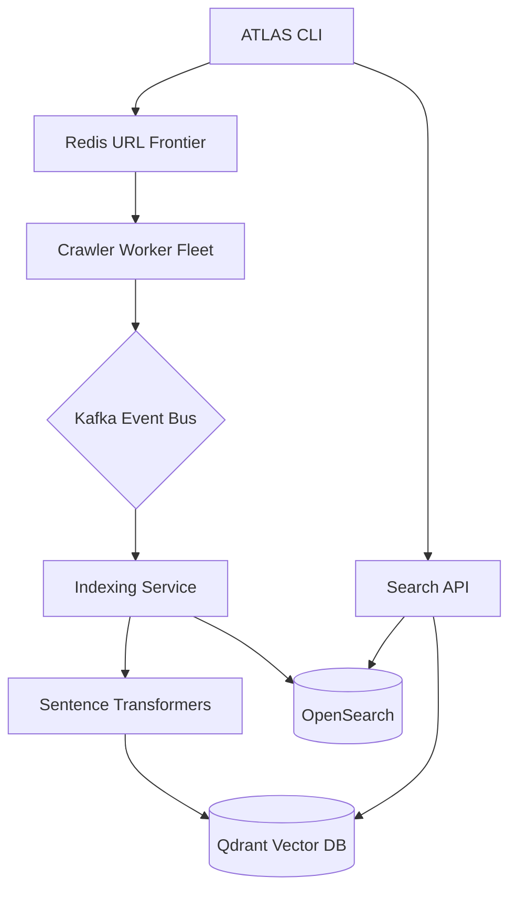

# ATLAS: Distributed Web Crawl & Indexing CLI Engine


**ATLAS** is a production-grade, distributed web intelligence engine designed for large-scale internet crawling, indexing, and semantic search. It provides a CLI-native experience for orchestrating complex information retrieval pipelines.

## Key Features

- **Distributed Architecture**: Multi-node crawling and indexing powered by a Redis-backed URL frontier.
- **CLI-Native Control**: High-fidelity terminal interface with real-time telemetry and executive dashboards.
- **Hybrid Search (RRF)**: Reciprocal Rank Fusion combining OpenSearch (Keyword) and Qdrant (Vector) for maximum precision.
- **Simulation Mode**: Built-in mock mode allows full CLI and dashboard testing without active infrastructure.
- **Containerized Stack**: Fully orchestrated multi-service environment via Docker and Makefile.

## System Architecture



## Monorepo Structure

- `apps/cli`: Cyber-minimalist terminal control layer.
- `apps/crawler`: Distributed aiohttp worker engine.
- `apps/indexer`: Hybrid indexing service (Keyword + Vector).
- `apps/search_api`: FastAPI gateway with RRF ranking.
- `services/url_frontier`: Redis-backed priority queue & politeness manager.
- `services/embedding_engine`: Semantic vector generation (Sentence-Transformers).
- `libs/core`: Pydantic-based configuration and system settings.
- `infrastructure/docker`: Orchestration and containerization logic.

## Quick Start

### 1. Configure Environment
```bash
cp .env.example .env
```

### 2. Run in Simulation Mode (No Infrastructure Required)
If you don't have Docker or databases running, ATLAS automatically enters MOCK_MODE.
```bash
$env:PYTHONPATH="."; python apps/cli/main.py status
$env:PYTHONPATH="."; python apps/cli/main.py crawl dash
```

### 3. Run Production Stack (Docker Required)
```bash
make build
make up
```

## Tech Stack

- **Core**: Python 3.11+, Typer, Rich, Pydantic V2
- **Vector Search**: Qdrant
- **Keyword Search**: OpenSearch
- **Graph Engine**: Neo4j (In Development)
- **Queue/Frontier**: Redis
- **Stream Processing**: Kafka (Redpanda)

---
Developed by the Atlas Intelligence Team.
